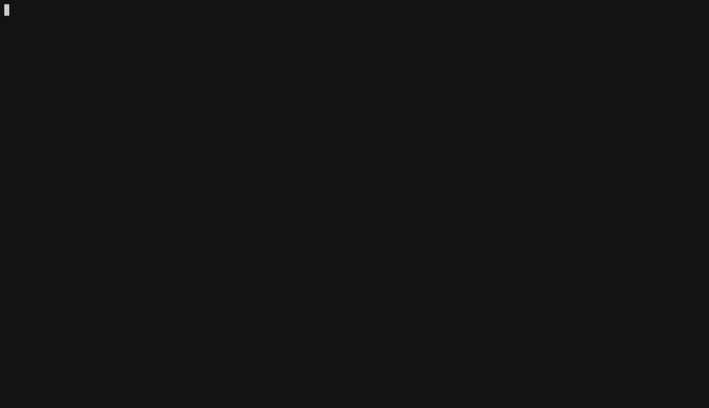

# assets-from-spf

- A Python script to parse netblocks &amp; domain names from SPF(Sender Policy Framework) DNS record
- For every parsed asset, the script will also find and print Autonomous System Number(ASN) details
- For now, the output is printed in JSON format only 

## Demo



## Screenshots


## 3rd party package dependency 

1. [**ipwhois**](https://github.com/secynic/ipwhois)

2. [**click**](https://pypi.python.org/pypi/click)

## Setup

- Clone this repo

```bash
$ git clone git@github.com:yamakira/assets-from-spf.git
```

- Install dependencies

```bash
$ pipenv install
```


- Check help menu


```bash
$ python assets_from_spf.py --help
Usage: assets_from_spf.py [OPTIONS] DOMAIN

Options:
  --asn / --no-asn  Enable/Disable ASN enumeration
  --help            Show this message and exit.
```

## Usage

- Parse the SPF record for assets but don't do ASN enumeration


```
$ python assets_from_spf.py target_url
```

- Parse the SPF record for assets and do ASN enumeration

```
$ python assets_from_spf.py target_url --asn
```

```
$ python assets_from_spf.py target_url -a
```
